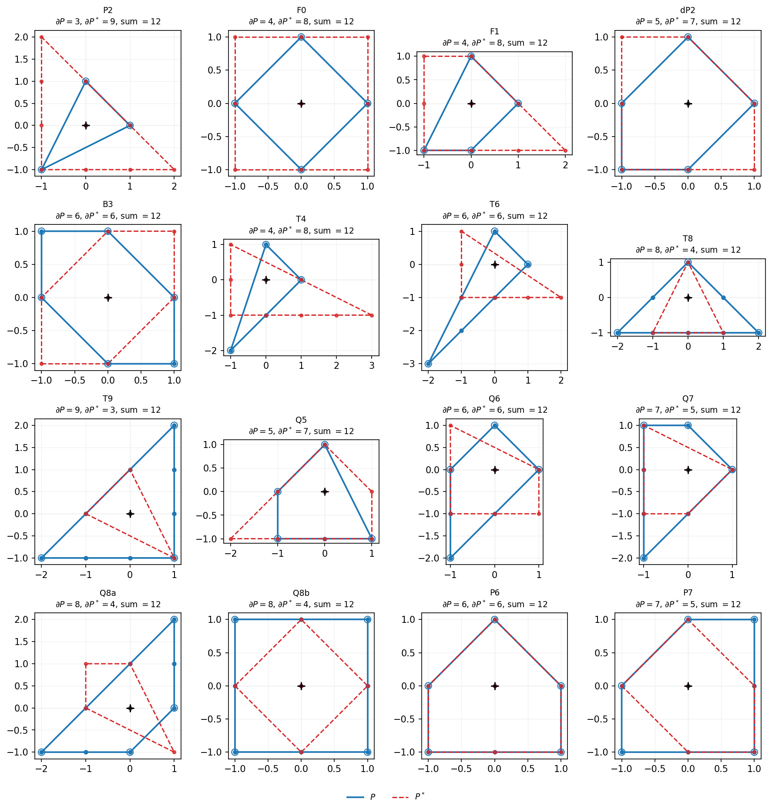
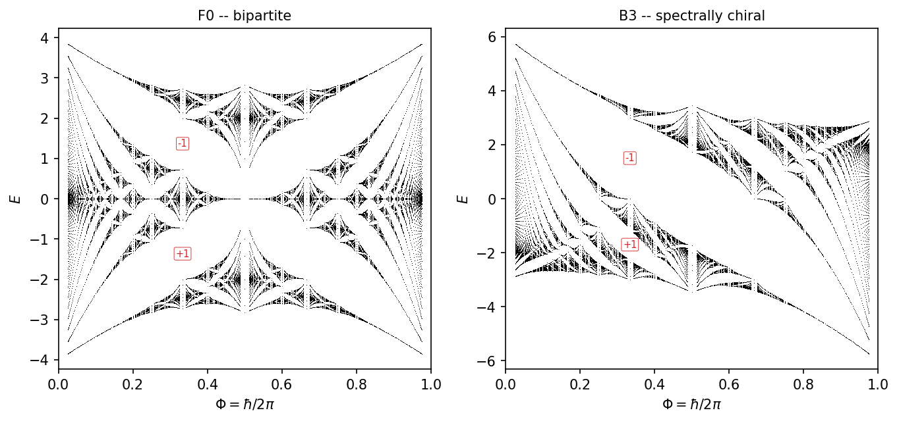
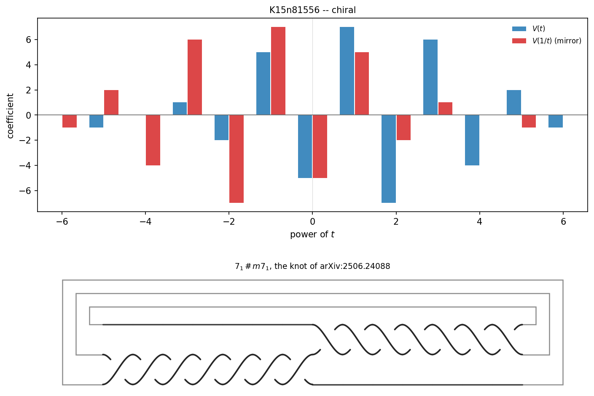
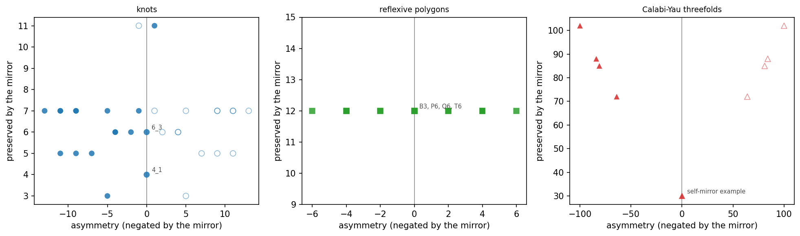
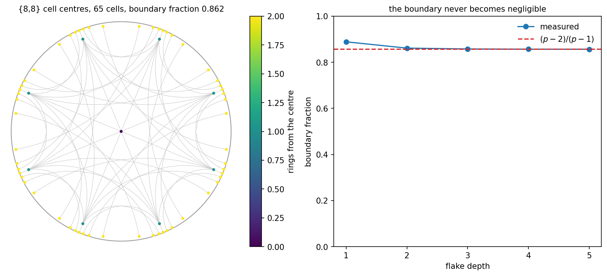
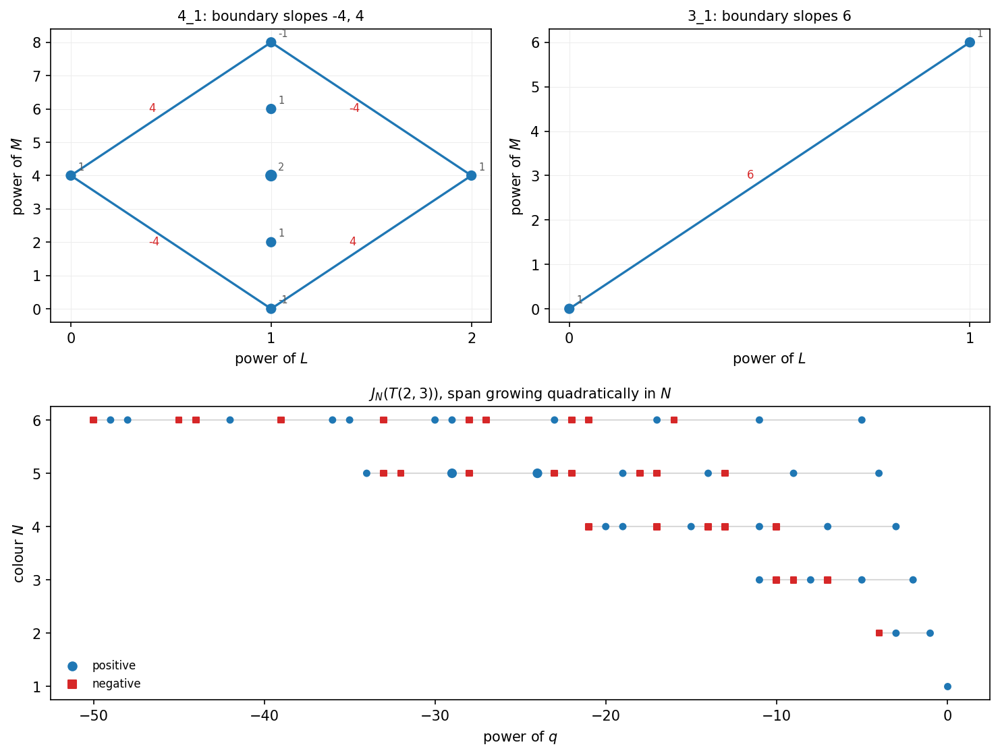

# pyCICY-X: The heterotic pipeline:
## from a configuration matrix to a spectrum
### Exact Calabi–Yau topology, a complete heterotic model-building pipeline, and the spectral analogies that connect them.
---

A pure-Python toolkit: `numpy`, `scipy`, `sympy`. No SageMath, no Mathematica,
no GPU, no training runs. Everything is exact integer or rational arithmetic
where the mathematics allows it, and every number that can be reached by two
independent routes is computed both ways and checked.

## Papers and figures

- Supplementary material: figures for the Extended pyCICY package —
  https://doi.org/10.5281/zenodo.21798923

What follows is a tour of the results, roughly in the order the modules were
built.

---

## What it does

**Calabi–Yau topology (the original core, `pyCICY`, `transitions`, `cicylist`)**
Configuration matrices, Chern classes, triple and quadruple intersection
numbers, Hodge data via the Leray spectral sequence and Bott–Borel–Weil, line
bundle cohomology, favourability, Kollár divisors. Conifold transitions, normal
forms, the split web over the published list of 7890 threefolds.

**Heterotic model building — the full arc, end to end**
- `bundles` — sums of line bundles and monads: Chern characters, indices,
  anomaly cancellation, poly-stability, `SU(5)` spectra, and cost-ordered
  scans over both constructions.
- `equivariant` — group actions on line bundles. The character-valued index
  from the Koszul complex, exact in integers, for cyclic and finite abelian
  groups acting by permutation and phase on both the ambient factors and the
  defining polynomials — and, via an explicit matrix lift, the invariant index
  and freeness test for arbitrary finite groups including non-abelian ones.
  Two independent freeness tests.
- `breaking` — Wilson lines, `SU(5)`/`SO(10)`/`E_6` branchings,
  doublet–triplet splitting, and the chiral spectrum on the quotient derived
  rather than assumed.
- `symmetries`, `phenomenology` — freely acting quotients and standard-embedding
  generation counts.

**String constructions (`theories/`)**
A subpackage where different compactifications live, sharing the exact
machinery underneath and each declaring what it can compute. Two so far:
`StandardEmbedding` (V = TX, E₆) and `LineBundleModel` (SU(5) and the Standard
Model). Type IIA, IIB orientifolds, F-theory would go here; they are not
implemented.

**The metric bridge (`export`)**
Hands verified models to the numerical-metric packages. Generates a defining
polynomial with the right multidegree, invariant under the model's freely
acting group, and filtered for smoothness over a finite field; supplies the
Kähler moduli at the point where the bundle is actually poly-stable; exports
the group as explicit matrices. Plus, on a
[cymetric fork](https://github.com/brentharts/cymetric), an equivariant point
generator and a group-averaged network that makes the learned metric exactly
invariant under the quotient group.

**Toric and polytope geometry (`toric`, `polytope`)**
The sixteen reflexive polygons, rederived rather than tabulated. Reflexive
polytopes in *any* dimension, polar duality, face lattices, and Batyrev Hodge
numbers for Calabi–Yau hypersurfaces — calibrated on the quintic.

**Spectral analogies (`quantum_curve`, `hofstadter`)**
Quantized mirror curves of local Calabi–Yaus as Hofstadter models, and the
closed-form characteristic polynomial of the Hofstadter Hamiltonian
(Marra–Proietti–Sheng), with modular duality and the Chambers relation.

**Enumerative and arithmetic tools (`enumerative`, `smoothness`)**
Chern polynomials, Hilbert series, genus-zero Gopakumar–Vafa invariants;
Jacobian-rank smoothness testing over finite fields.

**Cross-domain structure (`knots`, `apolynomial`, `chirality`, `additivity`,
`hyperbolic`)**
Knot invariants, A-polynomials and the AJ conjecture, chirality as a formal
involution across domains, hyperbolic lattices and automorphic Bloch theory.

**Checked claims from the literature (`flavor`)**
An implementation of a specific recent proposal, faithful to what it states,
with the places its arithmetic does not close recorded rather than smoothed
over.

---

## What "end to end" does and does not mean

The chain now runs from a configuration matrix to a trained metric on a
Calabi-Yau quotient:

    configuration matrix
      -> poly-stable SU(5) bundle with the right index          (bundles)
      -> equivariant index character of a free group action      (equivariant)
      -> three chiral generations downstairs                     (breaking)
      -> a Gamma-invariant defining polynomial, smooth over F_p  (export)
      -> Kahler moduli at the bundle's stability point           (export)
      -> orbit-closed point sample and a trained metric          (cymetric fork)

Every step before the last is **exact** and cross-checked. The last one is a
neural-network fit, and it is worth being precise about its status.

`make metric-validation` reports three residuals. Two of them —
the Monge-Ampère residual and the Ricci measure — say whether the metric has
converged, and on a short CPU run they emphatically have not: `sigma ~ 0.56`,
`Ricci ~ 30`. They fall with epochs and points, and nothing in this repository
has yet been run long enough to call the metric converged. The third, the
deviation of the learned metric under the group, is `1.6e-07` for a
symmetrised network against `1.8e-02` for a plain one, and that one *is* exact:
group-averaging the potential makes invariance structural rather than learned.

**One Yukawa coupling *is* exact.** For the standard embedding the coupling of
three (1,1)-type families is the triple intersection number,

    Y_rst = int_X J_r ^ J_s ^ J_t = d_rst ,

an integer, computed from the configuration matrix with no metric anywhere. It
receives worldsheet instanton corrections from the genus-zero Gopakumar-Vafa
invariants, so on the quintic

    Y(q) = 5 + 2875 q/(1-q) + 8 * 609250 q^2/(1-q^2) + ...

with every coefficient an integer. `theories.StandardEmbedding` computes both,
and reports whether the instanton sum has actually converged — the invariants
grow fast enough (n_5 = 2.3e14 on the quintic) that at `q = 0.01` the
degree-five term alone is 3e6 and the partial sum is meaningless, while at
`q = 1e-4` it is a coupling.

**But no physical couplings, no masses, no predictions.** Physical couplings need
harmonic representatives of the cohomology classes as well as a metric, and
neither this package nor the bridge computes them.
`phenomenology.MassRatioNotComputable` is still an exception rather than a
number, deliberately: *"a function that returned None or a placeholder float
would sooner or later be plotted next to a measured constant, and at that point
nothing in the figure would distinguish a computed number from an invented
one."* That applies to the README as much as to the code.

**The check that would settle it is not done.** Chern-Gauss-Bonnet gives `chi`
from the curvature of any Hermitian metric, so computing it from the trained
metric and comparing against the exact `chi = -128` this package derives from
the configuration matrix would validate the entire chain rather than its
interfaces. cymyc implements the integral; matching its local-coordinate and
pullback conventions to cymetric's data has not been done. Until it is,
"the metric is good" means "these residuals are small", which they are not yet.

## Where this sits among other open-source tools

The Calabi–Yau software ecosystem splits cleanly, and this package is on one
side of the split. It is worth being blunt about which.

| Tool | What it does | Relation to this one |
| --- | --- | --- |
| [cymetric](https://github.com/pythoncymetric/cymetric) and its maintained fork [ruehlef/cymetric](https://github.com/ruehlef/cymetric) | Neural-network approximations to moduli-dependent Ricci-flat metrics; point generators for CICYs and Kreuzer–Skarke hypersurfaces (TensorFlow, plus PyTorch/JAX in the fork) | **Complementary.** They compute the thing this package explicitly declines to: the metric. Needs SageMath/Mathematica for point generation |
| [cymyc](https://github.com/Justin-Tan/cymyc) | JAX numerical differential geometry on Calabi–Yaus: curvature, complex-structure moduli, and **physical Yukawa couplings** ([arXiv:2401.15078](https://arxiv.org/abs/2401.15078)) | **Complementary, and ahead where it counts.** `phenomenology.why_not_masses` raises rather than guessing mass ratios; cymyc actually computes them numerically |
| [cyjax](https://github.com/ml4physics/cyjax), [MLGeometry](https://github.com/yidiq7/MLGeometry) | Donaldson's algorithm and ML metrics in JAX/TensorFlow | Complementary, same reason |
| [cicy-topology-ml](https://github.com/samreetdhillon/cicy-topology-ml) | A CNN that *predicts* `h^{1,1}` and `h^{2,1}` from configuration matrices (96.7% and 76.5% exact accuracy on the 7890) | **Overlapping, opposite method.** This package *computes* the same Hodge numbers exactly, via Leray and Bott–Borel–Weil. Useful as a cross-check on ML predictions rather than a competitor |

**The honest summary.** If you need a Ricci-flat metric, a physical Yukawa
coupling, or a fermion mass, use `cymyc` or `cymetric` — this package cannot
give you any of them and says so in every relevant docstring. Physical
couplings need the Kähler potential, and the Kähler potential needs the metric.

What this package offers instead is the exact, metric-independent layer:
everything an index theorem, a spectral sequence, or a lattice count can
settle, computed symbolically and cross-checked, plus a heterotic pipeline
that runs from a configuration matrix to a Standard Model spectrum without
a single numerical approximation in the chain. As far as we know the
`bundles → equivariant → breaking` arc — scan for stable bundles, derive the
group action's index character, quotient, break with a Wilson line — is not
available end-to-end in another open-source package.

## Roadmap
The natural workflow is to use both, and `pyCICY.export` now automates the
handover: fix the topology and the spectrum here, then hand the surviving
models to `cymetric` or `cymyc` for the metric and the couplings. What this
package adds to that handover is the part a metric package cannot know — that
the defining polynomial must be invariant under the model's freely acting
group, that the Kähler moduli must sit at the bundle's stability point, and
that the group must preserve the holomorphic form or the quotient is not
Calabi-Yau at all. Get any of those wrong and a perfectly good metric gets
trained on the wrong space, with nothing downstream to complain. That handover
is automated; `make metric-validation` runs it.

Next, in order of what would change what this package can claim:

1. **Chern-Gauss-Bonnet.** Compute `chi` from the trained metric and compare
   against the exact value. It is the one measurement that validates the whole
   chain rather than its interfaces, and it needs cymyc's coordinate and
   pullback conventions matched to cymetric's data.
2. **A converged metric.** Long GPU runs, until the Monge-Ampère and Ricci
   residuals are small enough to mean something.
3. **Harmonic representatives.** The holomorphic Yukawa couplings of a line
   bundle model are cup products `H^1(V) x H^1(V) x H^1(Lambda^2 V) -> C`.
   They are quasi-topological and would be *exact*, like the standard-embedding
   ones — but evaluating them needs explicit cohomology representatives, and
   this package computes dimensions. That is a missing feature, not an
   obstruction, and `theories` keeps it distinct from the physical coupling,
   which is obstructed. Physical couplings additionally need the metric, and
   masses additionally need moduli stabilisation. That chain is the remaining
   distance between this toolkit and a prediction.


---

## Quickstart

```bash
git clone https://github.com/brentharts/CICY.git && cd CICY
pip install -r requirements.txt
python3 run_tests.py            # 14 suites, ~3 minutes
make help                       # every worked example
```

The heterotic pipeline, from a configuration matrix to a spectrum:

```python
from pyCICY import CICY, bundles, equivariant, breaking

X = CICY([[1,2],[1,2],[1,2],[1,2]])            # the tetraquadric
V = bundles.scan(X, rank=5, charge=2, generations=3,
                 symmetry_order=2, require_stability=True,
                 max_seconds=30)[0]             # a poly-stable SU(5) bundle
A = equivariant.TETRAQUADRIC_Z2()               # a free Z_2 on X
breaking.chiral_spectrum(A, V, wilson=(0,1))    # 3 generations, anomaly 0
```

That prints a truncation warning before the answer, and it is meant to: the
scan hit its 30-second budget having covered two of the outer choices, so the
list it returned is a slice of the search box rather than all of it. A
truncated result and an exhaustive one are different objects and the package
never lets them look alike.

Worked end to end, with every filter and its cost, in
`examples/line_bundle_models.py`.

---

### The sixteen reflexive polygons



Each panel is the toric diagram of a local Calabi-Yau `K_S`, drawn with its
lattice points (solid) and its polar dual `P*` (dashed). The dual is the
Batyrev mirror. Every title records the twelve theorem,
`#dP + #dP* = 12`, which holds in all sixteen cases however the boundary
points are shared out. The classification is not assumed:
`toric.verify_named()` rederives the list by brute force, and the five smooth
cases -- `P2`, `F0`, `F1`, `dP2` and `B3 = dP3` -- are *detected* by the
criterion that the vertex count equal the boundary count, not tabulated.

### Hofstadter spectra of quantized mirror curves



Quantizing the mirror curve of a local toric Calabi-Yau turns it into an
electron hopping on a 2d lattice in a magnetic field
([arXiv:1701.01561](https://arxiv.org/abs/1701.01561)): lattice points of the
Newton polygon are hopping vectors, and `hbar/2pi` is the flux per unit cell.
The square polygon of local `F_0` gives the square lattice and the classic
butterfly; the hexagonal polygon of local `B_3 = dP_3` gives the triangular
lattice. Annotations at `Phi = 1/3` are gap Chern numbers from the
Diophantine equation `r = q*s + p*t` with `|t| <= q/2`.

The triangular butterfly is visibly slanted. `E(Phi) = -E(1-Phi)` holds for
all sixteen geometries, but `E(Phi) = E(1-Phi)` only in the bipartite cases --
and bipartiteness is a condition on the polygon *modulo two*, not a reflection
symmetry of it. Only `F_0` and `T4 = P(1,1,2)` are bipartite, so fourteen of
sixteen spectra are asymmetric in `E`. `B_3` is centrally symmetric as a
polygon and still spectrally chiral; `T4` is the other way round.

### Chirality of K15n81556, and the additivity counterexample



Upper: the Jones polynomial of the fifteen-crossing census knot `K15n81556`
against that of its mirror, coefficient by coefficient. The two are
reflections about `t^0` and do not coincide, so the knot is chiral. This
reproduces the observation of Wang and Zhang
([arXiv:2507.14265](https://arxiv.org/abs/2507.14265)) that the two diagrams
of `K15n81556` in the Brittenham-Hermiller argument
([arXiv:2506.24088](https://arxiv.org/abs/2506.24088)) are a chiral knot and
its mirror rather than the same knot. The determinant is 39 for both, so
detecting the chirality needs an invariant not symmetric under `t -> 1/t`.

Lower: the connected sum `7_1 # m7_1`, whose unknotting number breaks
additivity, as a braid closure. The connected sum of two braid closures is the
juxtaposition of their words on one more strand than the two together, so this
is the closure of `s1^7 s2^-7` on three strands; the two halves have visibly
opposite handedness.

### One mirror operation, three domains



Three mirror operations of the same shape: each is an involution that swaps a
pair of integers and preserves their sum or span. Horizontally the combination
the mirror negates, vertically the one it preserves, so mirror partners sit
symmetrically about zero (filled = object, hollow = its mirror) and objects
fixed by their involution lie on the axis. The right-hand panel is the
conventional Hodge plot in disguise, since its horizontal coordinate is
`chi/2`.

Quantized curves are absent deliberately: reflecting their Newton polygon
leaves the spectrum *exactly* unchanged, so no spectral invariant can detect
that involution, and the package reports it as undetermined rather than as
achiral.

### The Hofstadter characteristic polynomial

`pyCICY.quantum_curve` quantizes the mirror curve of a local Calabi-Yau and
diagonalises the difference operator. That gives eigenvalues; the butterfly is
a scatter plot of them. What it never had was the characteristic polynomial as
an object.

`pyCICY.hofstadter` supplies one, from Marra, Proietti and Sheng,
*Hofstadter-Toda spectral duality and quantum groups*,
[arXiv:2312.14242](https://arxiv.org/abs/2312.14242). Their Theorem III.9
writes `f(E) = det(H - E)` at the mid-band point as a sum over *two-step*
elementary symmetric polynomials — those skipping adjacent indices —
evaluated at `sin^2(j pi alpha)`.

```python
from pyCICY import hofstadter as H

H.char_poly_coefficients(3, 7)      # the degree-7 polynomial, flux 3/7
H.verify_theorem_III9()             # against numpy.linalg.det: 4e-10
H.zero_mode_point(8)                # ('centre', (0.0, 0.0))
```

Every claim implemented was verified against an independent numerical
computation before being written down, and all of them hold:

| claim | checked against | worst error |
| --- | --- | --- |
| Theorem III.9 | `numpy.linalg.det`, 10 coprime `P/Q` | 4e-10 |
| Remark III.11, `etilde_{Q/2}(sin^2) = 4^-(Q/2-1)` | closed form, all even `Q <= 14` | 1e-16 |
| Chambers relation | 36 random Brillouin points | 5e-9 |
| zero-mode parity rule | `Q = 3..12`, all three cases | exact |

Two things are worth pulling out. The `etilde` are computed by the Lemma III.6
recurrence rather than by enumerating subsets — `O(n^2)` instead of `O(2^n)`,
and 270 times faster already at eighteen variables. A degree-201 polynomial
takes 3 ms; the same by enumeration would need `2^200` subsets, and `Q` of a
few hundred is where the butterfly is actually drawn.

And the module earns its place by overlapping the geometry. `quantum_curve.harper()`
is the square lattice, built from the Newton polygon of the local `F_0` mirror
curve following Hatsuda, Sugimoto and Xu — who are reference 11 of this paper.
`hofstadter` builds the same operator from Definition I.5 of a different paper.
Band extents agree to 2e-3, and the test suite requires it.

The spectral duality `alpha -> 1/alpha` is implemented only as far as it is
testable. The paper is explicit that the induced map `E -> Etilde` is unknown
in closed form — that is the open problem the formula is meant to serve — so
`spectral_duality_check` returns both sides and does not pretend to solve it.

```console
python3 examples/hofstadter_duality.py
make hofstadter FLUX=5/11
```

## Reflexive polytopes in any dimension, and the 24-cell

`pyCICY.toric` is two-dimensional throughout and none of it generalises: its
`dual` assumes an ordered vertex cycle and its `lattice_points` scan-converts a
polygon. `pyCICY.polytope` lifts the machinery to arbitrary dimension, which
matters because a reflexive **four**-polytope gives a Calabi-Yau threefold by
the Batyrev construction — the compact side of the package reached from the
toric side.

Correctness is by overlap rather than assertion: in two dimensions the new code
must reproduce the old one, and it does, on all sixteen reflexive polygons.

```python
from pyCICY import polytope as P

P.batyrev_hodge(P.polar(P.simplex(4)))   # the quintic: (1, 101), chi = -200
P.is_reflexive(P.d4_roots())             # reflexive — but in which lattice?
P.f_vector(P.twenty_four_cell())         # [24, 96, 96, 24]
```

Two convention traps, both caught by cross-checking and both now explicit.
`toric.dual` uses `P* = {y : <x,y> <= 1}` while Batyrev's is `<x,y> >= -1`; the
first version of `polar` agreed with `toric.dual` on only 3 of 16 polygons, the
ones whose dual is centrally symmetric. It is a uniform `y -> -y`, so `polar`
takes a `convention` argument. Worse, `batyrev_hodge` takes Δ, the *Newton*
polytope, not Δ*: passing `simplex(4)`, the fan polytope of `P^4`, silently
returns `(101, 1)`, the mirror quintic. The calibration is now in the tests —
`l(Delta) = C(9,4) = 126`, one lattice point per quintic monomial.

### Reflexivity is a property of a polytope *and a lattice*

The 24-cell is the case that makes this unavoidable. Written as the `D_4` roots
`±e_i ± e_j`, its polar has vertices `{±e_i}` together with the sixteen
`(1/2)(±1,±1,±1,±1)` — half-integral, so the 24-cell is **not reflexive with
respect to `Z^4`**. It is reflexive with respect to the lattice its own
vertices generate, `D_4 = {x in Z^4 : sum x_i even}`, of index 2, and there both
it and its dual are honest lattice polytopes with 24 vertices. So
`is_reflexive` reports *which lattice it used*: "is the 24-cell reflexive" has
no answer until the lattice is named.

Both Δ and Δ* have exactly 25 lattice points — their 24 vertices and the origin
— so no proper face has an interior lattice point and both Batyrev correction
sums vanish identically:

    h^{1,1} = h^{2,1} = 20 ,   chi = 0 .

Self-duality forces `h11 = h21` with no arithmetic at all, so two independent
arguments land in the same place. Braun's Hodge numbers `(1,1)`
([arXiv:1102.4880](https://arxiv.org/abs/1102.4880)) are those of a *free
quotient* of this cover; enumerating free quotients is the boundary
`pyCICY.symmetries` draws on the CICY side, and it is not crossed here.

## Equivariant structures: the ambiguity that turned out not to matter

`pyCICY.breaking` computes what survives on X/Gamma *given* the representation
of Gamma on the upstairs cohomology, and says plainly that it cannot derive it:
that needs an equivariant structure, a lift of the Gamma action to the total
space of each line bundle. `pyCICY.equivariant` supplies the part that is
exactly computable, and the answer is more definite than expected.

**Why anything is computable.** The individual `H^q(X, L)` as Gamma-modules
need the Leray spectral sequence run equivariantly, and its differentials are
not fixed by the degrees — the same obstruction behind `Monad.cohomology_bounds`.
But characters are *additive on exact sequences*, so the character-valued index
can be read off any equivariant resolution with no spectral sequence anywhere.
The Koszul resolution of `O_X` in the ambient product does it:

    ind_Gamma(O_X(k)) = sum_{S} (-1)^{|S|} (prod_{a in S} c_a^{-1})
                        chi_Gamma(A, O_A(k - sum_S d_a))

a finite sum of Kunneth products of monomial characters, in exact integer
arithmetic. Its total must equal `CICY.line_co_euler` — separate code, separate
formula, and floating point where this is exact. Checked on 625 bundles.
(`line_co_euler` returns `5.6e-17` where the Koszul route returns integer `0`.)

**Freeness, two independent ways.** For `g != e` acting freely there are no
fixed points, so the holomorphic Lefschetz number vanishes — equivalently the
index character is a multiple of the *regular* representation, the charges
equidistributed. Separately, a diagonal action fixes the ambient coordinate
points, and if the corresponding pure monomial carries the wrong charge it
cannot appear in a defining polynomial, so that polynomial vanishes there and
the fixed point lies on X. The two routes must agree wherever both can see, and
do — but neither is complete, and the tests record cases proving it. The
geometric one misses an action trivial on a whole factor (no coordinate point is
forced, yet the fixed locus is two-dimensional); the Lefschetz one is necessary
only, and depends on the probe set — an action trivial on two factors passed a
hand-picked list of five probes and fails 180 of a 625-probe box. The genuinely
free action passes all 625.

This caught something I would have got wrong by hand: on the tetraquadric the
`Z_2` action `[x0:x1] -> [x0:-x1]` is free, but the same weights for `Z_3`,
`Z_4` or `Z_5` are **not** — 11, 8 and 15 of the 16 coordinate fixed points are
forced onto X, because the monomial `x_11^2 x_21^2 x_31^2 x_41^2` has charge
`8 mod n`, which is `0` only for `n = 2` (and 4... where other points fail).

**The result.** For the `bundles.scan` model on the tetraquadric with that free
`Z_2`, the equivariant index character is `[-3, -3]` — three generations in
*each* Gamma-sector. That derives the equidistribution `breaking.worked_example`
had to assume.

And the equivariant structure **does not matter**. For a free action every
summand's character is a multiple of the regular representation, i.e. a constant
vector, and a twist permutes a constant vector to itself. So the entire chiral
spectrum downstairs is independent of which of the `n^r` structures is chosen.
The choice shows up only in `h^1` and `h^2` separately — the vector-like pairs,
which an index cannot see in any case. The ambiguity `breaking` flagged was
therefore confined to the non-chiral sector all along. The tests check both
halves: twisting is inert for the free action, and *not* inert for a non-free
one, so the argument is doing something rather than being ignored.

The weights are exponents of a diagonal action, but that is less restrictive
than it sounds and the first version of this section said otherwise. Any linear
map of finite order `n` diagonalises with `n`-th roots of unity as eigenvalues,
so an action permuting coordinates *inside* a factor is the diagonal case in a
different basis — the swap `[x0:x1] -> [x1:x0]` is `diag(1,-1)` in the basis
`x0 ± x1`, i.e. weights `(0,1)`, and a cyclic permutation of `d+1` coordinates
has weights `(0,...,d)`. Characters do not depend on the basis, so `euler()`
was already right for all of these; `weights_from_matrix` does the conversion.
What *does* depend on the basis is anything phrased through monomials, so
`admissible_polynomial_charges` and `forced_fixed_points` are statements about
the diagonalising coordinates. Permuting the ambient *factors* is genuinely not
implemented: it needs element-wise traces over the cycles of the permutation
rather than a product over factors.

`PermutationAction` handles the factors moving. `g^j` permutes the tensor
factors of `H^*(A, O(k))` by `sigma^j`, so its trace is a product over the
**cycles** of `sigma^j` rather than over the factors: on a cycle of length `L`
through `i` the contribution is the trace of the composite going once around,
diagonal with weights `sum_{s<jL} w_{sigma^s(i)}`, and the multiplicities
follow by Fourier inversion of `tr(g^j)`. With `sigma` the identity every cycle
has length one and this collapses to `CyclicAction` — checked on 625 bundles,
which is the regression oracle it was built against.

Two things it enforces. Only `sigma`-invariant bundles carry an equivariant
structure (`g^* O(k) = O(sigma^{-1} k)`), so `euler` raises rather than
returning a meaningless number, and `invariant_charges` enumerates the ones
that work — one free charge per *cycle*, so a box of 625 collapses to 25.
And `check_order` verifies the action really has the claimed order: `g^n` sends
factor `i` to itself by the composite of `n` maps, which must be a scalar
(not the identity — a global rescaling acts trivially on projective space).
My first version composed `n·L` steps instead of `n`, which is a different
group element; it accepted a `Z_4` action as a `Z_2` one, and the integrality
of the multiplicities did **not** catch it. `euler` now consults it.

A structural result falls out. **No cyclic action permuting the factors of the
tetraquadric is free.** Fixed points need an eigenvector of the composite map
around each `sigma`-cycle, and a linear map always has one; requiring
`g^n = id` forces that composite to be scalar, so the fixed locus is
positive-dimensional and X cannot avoid it. Checked exhaustively over all 1920
valid `Z_2` factor-permuting actions. This is why Braun's free actions on that
manifold are non-cyclic — they need a second generator, which is the next
extension rather than a limitation of the trace formula.

`AbelianAction` generalises this to `Gamma = Z_{n_1} x ... x Z_{n_r}`: each
element is a word in the generators, its `(sigma, w)` obtained by composing,
its trace a product over the cycles of *its own* permutation, and the
multiplicities a Fourier inversion over the character group. One generator
reproduces `PermutationAction` exactly on 625 bundles. It checks three
independent things — that each generator has the claimed order projectively,
that the generators commute projectively, and that the degree columns are
invariant — because none implies the others and a failure of any one makes the
index meaningless rather than merely inaccurate.

`AbelianAction` takes `polynomial_perms` too, one per generator, carrying the
same wedge sign and invariant-subset filter and validated by the same oracle —
which remains sensitive there (16 of 25 with the sign forced, identity total
still `1.4e-14`). It adds one consistency condition the cyclic case cannot
have: the generators must commute **on the defining polynomials** as well, and
that has no projective slack, since the `p_a` are functions rather than
homogeneous coordinates. Two transpositions on three polynomials fail it while
the factor data says nothing at all — both factor permutations may be the
identity.

### The free action, and why it has order four

A `Z_2 x Z_2` with one generator permuting and one phasing turns out **never**
to be free on the tetraquadric — 16384 valid actions, none of them. The reason
is immediate once seen: freeness requires *every* non-identity element to act
freely, and the permuting generator alone already has a positive-dimensional
fixed locus by the scalar-composite argument. No group containing it can help.

The escape is to make the permuting element's **square** a non-scalar phase,
which forces it to have order four. With `sigma = (01)(23)` and weights
summing to `(0,2) mod 4` around each transposition, `g^2 = diag(1,-1)` has
distinct eigenvalues, so its fixed points are isolated and X can miss them.
64 of the 256 such actions are free:

```python
F = E.PermutationAction([[1,2]]*4, 4, [1,0,3,2],
                        [[0,0],[0,2],[0,0],[0,2]], [0])
F.check_order()      # (True, [])
F.looks_free()       # True
F.euler([-2,-2,-1,-1])   # [-9,-9,-9,-9] — equidistributed over Z_4
```

Totals still match `line_co_euler` to 9e-16 across all 25 `sigma`-invariant
bundles in the box, and every character is equidistributed. The order-2 version
of the same shape is valid and *not* free, which is the contrast the argument
rests on and which the tests assert side by side.

### Non-abelian groups, and why they need an explicit lift

An element acts on the ambient by a permutation of factors plus linear maps,
and two such data give the *same* map on the ambient exactly when they differ
by a scalar on each factor. The defining polynomials do not respect that
quotient: rescaling factor `i` by `lambda_i` multiplies `p_a` by
`prod_i lambda_i^{d[i][a]}`, so the charge is a property of the representative,
not of the geometric element. Element equality is projective on the ambient and
**not** projective on the polynomials, and there is no way to have both.

`MatrixGroupAction` resolves it by working with an explicit lift: the group is
whatever the generators close up to under composition, with *exact* equality on
the full data. Every character is then unambiguous and the trace formula
applies verbatim — for arbitrary finite groups, abelian or not. The cost is
stated rather than hidden: `order` is the order of the lift, and
`scalar_subgroup` finds the elements acting trivially on the ambient, so
`geometric_order` is what belongs in `-ind(V)/|Gamma|`.

The demonstration is small and sharp. Rescaling one tetraquadric factor by
`-1` acts trivially on `P^1`, hence trivially on X, so the geometric group is
trivial while the lift has order 2. At `k = (1,0,0,0)` the two sections of
`O(1)` are odd under the scalar and **none** descend; at `k = (2,0,0,0)` they
are even and all four do. The ordinary index cannot see the difference; the
invariant index can.

**What is computed without a character table.** Decomposing the index into
irreducibles of a non-abelian group needs its character table, which this
package does not compute. But the two quantities the physics needs do not
require one: the multiplicity of the *trivial* representation — the index of
the descended bundle — is `(1/|Gamma|) sum_h L(h)`, an average of traces; and
the freeness diagnostic is the vanishing of every `L(h)` for `h != e`, tested
directly. So non-abelian groups are supported for those and **refused** for the
irreducible decomposition, rather than being handed a decomposition computed
against a table that isn't there. `S_3` and `S_4` on the tetraquadric factors
close correctly at orders 6 and 24, with `L(e)` matching `line_co_euler` to
4e-15.

### Permuting the defining polynomials, and an oracle for the sign

`polynomial_perm` allows `g*(p_a) = zeta^{c_a} p_{pi(a)}`. Two things change in
the Koszul sum: only subsets `S` with `pi^j(S) = S` sit on the diagonal of
`Lambda^r N*`, and each carries the **sign** of `pi^j` restricted to `S`,
because reordering `e_{pi(a_1)} ^ ... ^ e_{pi(a_r)}` back into increasing order
costs exactly that. Compatibility is checked as `d[sigma(i)][pi(a)] = d[i][a]`,
so neither permutation alone need preserve the degree matrix — only the pair.
Swapping polynomials of unequal degree is refused; swapping factors *and*
polynomials together is fine.

That sign is the one thing in this module the usual check cannot see. At the
identity `pi^0` is trivial and the sign is always `+1`, so **forcing the sign
to `+1` everywhere still reproduces `line_co_euler` exactly** — the guard that
validates everything else here is blind to it.

So it gets a separate oracle. On `[[1,1,1]]*5` — a favourable CY3 with
`chi = -80` — the two defining polynomials have identical multidegree, so
swapping them is, in the eigenbasis `p_± = p_1 ± p_2`, precisely the phase-only
action with charges `0` and `1`, which the already-tested path handles. The two
agree on all 25 bundles; forcing the sign wrong breaks **16 of 25** while
leaving the identity total at `1.4e-14`. The tests assert both halves, so the
oracle is on record as being sensitive rather than merely passing.

```python
from pyCICY import equivariant as E
A = E.TETRAQUADRIC_Z2()
A.looks_free()                            # True, over a 625-probe box
A.forced_fixed_points()                   # [] — none forced onto X
E.bundle_index_character(A, model)        # [-3, -3]
```

## The 24-cell flavour construction

`pyCICY.flavor` implements the Standard Model content of Ali, *Quantum
Spacetime Imprints: The 24-Cell, Standard Model Symmetry and its Flavor
Mixing*, [arXiv:2511.10685](https://arxiv.org/abs/2511.10685) — **as stated**,
with the paper's own numbers, and then checks it. Where a stated result does
not follow from its stated inputs, the function computes what the inputs give
and says so, rather than quietly substituting a parameter that makes the number
come out right. That is the policy `pyCICY.apolynomial` already follows when it
reports the leftover factor in the AJ classical limit instead of suppressing it.

**What is exact.** All fifteen Standard Model hypercharges are reproduced in
exact rational arithmetic, on fifteen distinct vertices of the sixteen in `V_2`
(the unused one is `(-1,1,-1,1)`), and `Tr(Y) = 0` generation by generation.
The tetrahedral projection gives a Gram matrix with every off-diagonal exactly
`-1/3`, so `J` has eigenvalues `{1/3, 4/3, 4/3}` and `U_TBM` diagonalises it:
tribimaximal mixing, `th12 = 35.26`, `th23 = 45`, `th13 = 0`.

**What does not follow, in three parts.**

*The hypercharges are fitted.* The functional has four components of `h_Y` plus
an offset, so five parameters against five targets. `fit_rank` finds the 5×5
system full rank for all three generations, so a unique solution exists for
*any* targets whatever.

*Generation 3 is a real exception, with a reason.* It sets `eps = 0`, leaving
four unknowns for five equations, and is nevertheless consistent. The five
vertices carry one linear dependency, null vector `c = (-1, 1, -1, -2, 1)`, and
consistency is exactly `c . Y = 0`. Imposing only the Yukawa relations
`Y_L = Y_eR + Y_H`, `Y_uR = Y_q + Y_H`, `Y_dR = Y_q - Y_H` collapses that to
`-4 Y_H - 2 Y_eR`, which vanishes because `Y_eR = -1` and `Y_H = 1/2`. So it is
a fact about the Standard Model hypercharges, not about the 24-cell — and
`epsilon_zero_census` finds 14592 of 437760 (subset, assignment) pairs share
the property, about one in thirty.

*The Minimal Distortion Principle has nothing to minimise.* Four points span an
affine subspace of dimension at most three, so orthogonal projection onto their
hull is an **isometry**: `mdp_distortion()` returns 2e-15. Since `eta` is
introduced as exactly that residual and then drives both `theta_13` and the
Cabibbo angle, the parameter doing the phenomenological work has no source in
the construction as described.

The two estimates then behave oppositely. `theta13_from_strain(0.017, 0.022)`
gives **8.52°** against the paper's 8.5 — the arithmetic closes. But the
Cabibbo formula `tan th_C ~ sqrt(2/3) * eta * 2` with the same `eta` gives
0.033–0.049, i.e. 1.9–2.8°, not the stated 0.22–0.26. Reaching the measured
0.2250 needs `eta = 0.138`, **6.3 times** the 0.022 the reactor angle requires,
and `eta` is described as universal across the quark and lepton sectors.
`cabibbo_angle` returns both the computed value and `eta_for_quoted` so the gap
stays visible. There is no v2 of the paper.

Two smaller corrections are recorded in `polytope`: the paper's two vertex sets
are the polar **dual pair**, not two descriptions of one polytope, and the count
of regular tetrahedra with `||v_i - v_j||^2 = 4` is **48**, not 576 — and 48 is
every equilateral four-subset at *any* edge length, so the figure is not
recoverable by relaxing the criterion. The 48 is structural: the condition is
pairwise orthogonality, the twelve diagonals fall into three orthogonal frames
of four, and each frame carries `2^4` sign choices.

```console
python3 examples/twentyfour_cell.py
python3 examples/twentyfour_cell.py --act flavour --no-census
make polytope
```

## Hyperbolic lattices, and why finite patches fail



Left: a patch of the `{8,8}` tessellation in the Poincare disk. The marked
points are cell centres, which for the `{4g,4g}` family form the Bravais
lattice of a genus-`g` surface; bonds are drawn as true geodesics, circular
arcs meeting the boundary at right angles, not chords.

Right: the fraction of cells that are not fully coordinated, against flake
depth. It does not tend to zero. Each ring is `p-1` times the last, so the
rim fraction tends to `(p-2)/(p-1)` -- 6/7 for `{8,8}`, 10/11 for `{12,12}`
-- shown dashed. A finite patch is therefore never a good stand-in for the
bulk, which is the quantitative reason hyperbolic band theory needs periodic
boundary conditions and automorphic functions
([PNAS 119 e2116869119](https://doi.org/10.1073/pnas.2116869119)).

### A-polynomials and colored Jones



Upper: Newton polygons of the A-polynomials of the figure-eight and the
trefoil, annotated with the coefficient at each lattice point and with the
edge slopes in red. Those slopes are boundary slopes of incompressible
surfaces in the knot complement, and come out at `±4` and `6 = pq`.

Lower: the colored Jones polynomials of the trefoil from the Rosso-Jones
formula, one row per colour, marker shape giving the sign of the coefficient.
The span grows quadratically in `N`. The row `N = 2` is the ordinary Jones
polynomial and agrees coefficient for coefficient with the Kauffman-bracket
computation elsewhere in the package.

The same lattice points are what the quantized-curve machinery consumes as a
hopping set -- the concrete link between the two ends of the package. That
link is about the quantization *rule*, not the geometry: a toric diagram is a
reflexive polygon and an A-polynomial's Newton polygon is not.

### The original CICY figures

The split-web figures are described in the supplement and rebuilt by
`make figures`: `hodge_depth`, `hodge_favourable`, `node_counts`,
`node_validation`, `ch2_check`, `gv_invariants`, `additivity`, `generations`,
`web_growth` and `quintic_surface`. The most important is `node_validation`,
which checks the node count from ambient intersection theory against the count
inferred from the Euler characteristic -- two computations with no shared code
that must land on the same integer for every split, and do.

# pyCICY

A python CICY toolkit, which allows the computation of line bundle cohomologies over Complete Intersection Calabi Yau manifolds. It further contains functions for determining various topological quantities, such as Chern classes, triple intersection and Hodge numbers. Installation is straighforwad with pip

```console
pip install pyCICY
```


## Quickstart

Import the CICY object from the module

```python
from pyCICY import CICY
```

Next define a CICY, for example the tetraquadric:

```python
M = CICY([[1,2],[1,2],[1,2],[1,2]])
```

Now we are able to do some calculations, e.g.

```python
M.line_co([1,2,-4,1])
```

determines the hodge numbers of the line bundle L = O(1,2,-4,1).

Since the rank computation takes the most time we included [SpasM - github](http://github.com/cbouilla/spasm). The *rank_hybrid* executable of SpaSM has to be in your $PATH.

```python
T = CICY([[1,2,0,0,0],[1,0,2,0,0],[1,0,0,2,0],[1,0,0,0,2],[3,1,1,1,1]])
```

and do some computations:

```python
T.line_co([3,-4,2,3,5], SpaSM=True)
```

## Visualisation

Forked from: https://github.com/Kuo-TingKai/CalabiYauViz

`pyCICY.viz` renders the classic Calabi-Yau cross-section: the degree-n Fermat
hypersurface z1^n + z2^n = 1, projected from 4 real dimensions to 3.

```python
from pyCICY import viz

viz.plot(5)          # the quintic
viz.plot_grid(range(2, 9))
```

Because the degree-n Fermat hypersurface in P^(n-1) is exactly the CICY
`[[n-1, n]]`, the two halves of the package line up. `viz.describe` pulls the
real invariants out of the `CICY` object, so plots are labelled with computed
topology rather than just an index:

```python
>>> viz.from_cicy([[4, 5]])
5
>>> viz.describe(5)
'n=5  $h^{1,1}$=1  $h^{2,1}$=101  $\\chi$=-200'
```

The surface can also be exported as a single STL mesh:

```python
viz.write_stl('quintic.stl', 5, res=40)
```

There is a command line front end too:

```console
pycicy-viz --cicy '[[4,5]]' -r 40 -o quintic.png --stl quintic.stl
pycicy-viz --grid --range 2 9
```

Plotting needs matplotlib, which is an optional extra:

```console
pip install pyCICY[viz]
```

The rest of the package has no plotting dependency, and importing `pyCICY`
does not pull matplotlib in.

## Tests

```console
python3 run_tests.py
```

`tests/test_pycicy.py` checks the topological machinery against values from the
CICY literature (quintic, bicubic, tetraquadric, sextic fourfold) plus the
Euler identities. `tests/test_viz.py` checks the vectorised surface evaluation
against the original symbolic sympy formulation to machine precision, and
validates the STL output structurally. The full run takes a few minutes,
mostly in the line bundle cohomology checks.

## Local geometries and quantized mirror curves

`pyCICY.toric` and `pyCICY.quantum_curve` cover the *local* (non-compact,
toric) Calabi-Yau side, where the combinatorial backbone is a two-dimensional
reflexive polygon rather than a configuration matrix.

There are sixteen reflexive polygons up to `GL(2,Z)`. The table is not taken
on trust: `toric.verify_named()` rederives it by brute force, and the tests
check the twelve theorem, the duality involution and the identification of
the five smooth toric del Pezzo surfaces.

```python
from pyCICY import toric

toric.describe(toric.polygon('B3'))     # 'B3  6-gon  bdry=6  K^2=6  smooth'
toric.dual_name('P2')                   # 'T9'
toric.hoppings(toric.polygon('B3'))     # the six triangular-lattice neighbours
```

Quantizing the mirror curve of `K_S` turns it into an electron hopping on a
2d lattice in a magnetic field, following Sugimoto, *Calabi-Yau geometry and
electrons on 2d lattices*, [arXiv:1701.01561](https://arxiv.org/abs/1701.01561),
which generalises the local `F_0` / square lattice observation of Hatsuda,
Katsura and Tachikawa to local `B_3 = dP_3` and the triangular lattice. The
dictionary is: lattice points of the polygon are hopping vectors, and
`hbar/2pi` is the magnetic flux per unit cell.

```python
from pyCICY import quantum_curve as Q

Q.harper().gap_labels(2, 5)             # gap Chern numbers -2, 1, -1, 2
flux, energy = Q.butterfly('B3')        # the triangular-lattice butterfly
```

The spectrum is symmetric under `E -> -E` exactly when the lattice is
bipartite, which is a condition on the polygon *modulo two* and not a
reflection symmetry of it. Local `B_3` is centrally symmetric and still
spectrally chiral; `T4 = P(1,1,2)` is not centrally symmetric and is
spectrally symmetric. Only `F_0` and `T4` are bipartite, so fourteen of the
sixteen geometries are spectrally chiral. `E(Phi) = -E(1-Phi)` holds for all
sixteen. The survey script prints the whole table:

```console
python3 examples/toric_survey.py
python3 examples/toric_survey.py --flux 2/5 --gaps B3
python3 examples/toric_survey.py --plot F0 B3 --out /tmp
```

The overlap with the compact CICY side is deliberately narrow. The mirror
curve of `K_S` is an anticanonical curve of `S`, and when `S` is a product of
projective spaces that curve is a CICY one-fold, so `toric.anticanonical_cicy`
returns `[[2,3]]` for local `P^2` and `[[1,2],[1,2]]` for local `F_0`, and
`None` for the other fourteen. The local geometries are not themselves CICY
threefolds and the module does not pretend otherwise.

## Knots, chirality and unknotting number

`pyCICY.knots` computes the Jones polynomial from a planar diagram. It needs
no SnapPy, Sage or spherogram; the diagrams, including the fifteen-crossing
census knot `K15n81556`, are stored as data.

It exists because `pyCICY.additivity` already reasons by analogy about
Brittenham and Hermiller, *Unknotting number is not additive under connected
sum*, [arXiv:2506.24088](https://arxiv.org/abs/2506.24088), and the knot side
turns out to be directly checkable. Wang and Zhang,
[arXiv:2507.14265](https://arxiv.org/abs/2507.14265), observed that the two
diagrams of `K15n81556` in that argument represent a chiral knot and its
mirror image rather than the same knot, detected by the Jones polynomial:

```python
from pyCICY import knots

knots.from_name('3_1').jones()          # -t^-4 + t^-3 + t^-1
knots.torus_knot(2, 7).jones()          # agrees with from_name('7_1')
knots.chirality_report('K15n81556')     # chiral: True
```

The determinant of `K15n81556` is 39 for the knot and for its mirror, so
chirality needs an invariant that is not symmetric under `t -> 1/t`. Only
`4_1` and `6_3` in the table are not detected as chiral, and the Jones test
is sufficient but not necessary, so that means "not detected" rather than
"amphichiral".

Mirroring, connected sums, crossing changes and braid closures are all
supported. Unknotting numbers are *quoted* from the literature rather than
computed, since they are minima over all diagrams;
`knots.unknotting_search` gives diagram-dependent upper bounds only and its
docstring is explicit about why it cannot recover the Brittenham-Hermiller
bound by brute force.

```console
python3 examples/knot_chirality.py
python3 examples/knot_chirality.py --search 3     # slow, finds nothing, as expected
```

## Heterotic line bundle standard models

`pyCICY.bundles` supplies the piece `pyCICY.phenomenology` explicitly declines
to: a gauge bundle that is not the standard embedding. The construction is
that of Anderson, Gray, Lukas and Palti,
[arXiv:1106.4804](https://arxiv.org/abs/1106.4804) and
[arXiv:1202.1757](https://arxiv.org/abs/1202.1757), in which

    V = O(L_1) + ... + O(L_5),    sum_a L_a = 0,

so the structure group is `S(U(1)^5)` inside `SU(5)` inside `E_8`. Every
cohomology group the spectrum needs is then a sum of line bundle
cohomologies, which `CICY.line_co` already computes exactly.

```python
from pyCICY import CICY, bundles

X = CICY([[1,2],[1,2],[1,2],[1,2]])
V = bundles.LineBundleSum(X, [[-2,-2,-1,2],[-2,1,0,0],[1,-2,1,0],
                              [1,1,-1,0],[2,2,1,-2]])
V.index()                       # -6.0, from the triple intersection numbers
V.index_from_cohomology()       # -6.0, from the Leray spectral sequence
V.su5_spectrum()                # n(10)=24, n(10-bar)=18, n(5-bar)=54, ...
V.stability_locus()['found']    # True
```

The index is computed twice by code with nothing in common — one contraction
of `d_rst` against the charges, one run of the Leray spectral sequence per
summand — and a third time as the alternating sum of the computed
cohomology. Serre duality `h^q(V) = h^{3-q}(V*)`, of which `line_co` knows
nothing, is checked as a fourth constraint. This is the `node_validation`
discipline applied to bundles.

Monads `0 -> V -> B -> C -> 0` get their topology here too, but **not** their
cohomology. The `h^q(V)` follow from the long exact sequence only up to the
ranks of the maps `H^q(B) -> H^q(C)`, which depend on the morphism and not on
the degrees; `Monad.cohomology_bounds` returns the interval the sequence
gives and refuses to guess the rest.

Two things the degrees *do* settle, and both raise `NotABundle` rather than
returning nonsense. Exactness at the right-hand end needs `H^3(B) -> H^3(C)`
onto, so `h^3(B) < h^3(C)` makes the sequence impossible — `B = O(1)^3`,
`C = O + O(3)` on the quintic is the smallest case, where the trivial summand
of `C` contributes `h^3(O_X) = 1` by Serre duality and `B` has nothing to map
onto it. Without the check the formula returns `h^3(V) = -1`.

`bundles.scan_monads` searches them, and exists because the two `NotABundle`
conditions are cheap enough to be filters. Same cost ordering as `scan`:
`c_1 = 0` → index → anomaly → positivity → `h^3(B) >= h^3(C)` → whether a
stable bundle can exist at all. Two arithmetic facts worth knowing before
choosing a box. On the **quintic** every realisable monad index is a multiple
of five, so three generations is unreachable at any charge and any rank. On the
**tetraquadric** `ind = -3` is unreachable for the same parity reason that
blocks it for line bundle sums, while `-6` is not — so both constructions need
the same freely acting `Z_2` that `breaking.minimal_order` independently picks
out as the smallest group able to break SU(5).

One degeneracy is worth knowing about because nothing rejects it for you.
Positivity admits trivial summands: `O_X` has all charges zero, so every
summand of `C` exceeds it somewhere. On CICY 7833 at charge 3, *every* rank-4
monad with `ind = -6` surviving all filters has a trivial summand in `B`, so
none of them is a model — the structure group is smaller than advertised. The
tests assert that rather than filtering it away, since here the degeneracy is
not incidental to the box, it is the whole of it. `keep` is the place for a
predicate excluding them.

`cohomology_bounds(stable=True)` tightens by imposing `h^0(V) = h^3(V) = 0`,
which holds for any slope-stable bundle with `c_1(V) = 0` on a Calabi-Yau
threefold. That pins two of the three free ranks, leaving `r_1` alone, and
then `h^2 = h^1 + ind(V)` exactly — the two intervals have the same width and
are rigidly offset by the index. But the forced `r_2` need not be attainable:
for about one monad in ninety the sequence pins `h^3(V)` above zero and no
stable bundle arises however the coefficients are chosen. Both cases are swept
over 1200 random monads on three manifolds in `tests/test_bundles.py`, checking
that no cohomology dimension goes negative, that the index always lies in the
alternating range, and that the tightened bounds always lie *inside* the ones
they tighten — which is how the second bug was found.

### From SU(5) down to the Standard Model

`pyCICY.breaking` finishes the arc. Everything `bundles` produces is an SU(5)
spectrum on the *covering* space, and "three generations after quotienting by
|Gamma|" is at that stage a division, not a model. What turns SU(5) into
SU(3) x SU(2) x U(1) is a Wilson line on X/Gamma.

```python
from pyCICY import breaking as B

B.branching("10")            # (3,2)_{1/6} + (3bar,1)_{-2/3} + (1,1)_1
B.wilson_line_count(2)       # 1
B.minimal_order()            # 2
B.worked_example()           # 3 generations, anomaly 0, triplets projected out
```

The branching is computed from the hypercharge generator rather than tabulated,
and checked against `flavor.SM_HYPERCHARGES` — a table entered independently
for a different paper — which must agree up to conjugation, and does.

A Wilson line in the hypercharge direction is `W = diag(a,a,a,b,b)` with
`a^3 b^2 = 1`; its commutant is the Standard Model group when `a != b` and all
of SU(5) when `a = b`, in which case `W` is central and breaks nothing.
Counting those that work for `Z_n` gives a closed form, found by enumeration
and then proved:

    #{ (p,q) : 3p + 2q = 0 mod n, p != q }  =  n - gcd(n, 5)

It **vanishes exactly for n = 1 and n = 5**. So a `Z_5` quotient divides the
generation count by five and still cannot break the GUT group — every
compatible Wilson line is central — while `Z_2`, the order the tetraquadric
models of `bundles.scan` require, is the smallest that can. That is not
automatic, and is worth checking before trusting a scan's `|Gamma|`.

Doublet-triplet splitting comes out as a condition on charges rather than a
tuning: with `W = (0,1)` the weak doublet inside the 5bar shifts by `-q = 1`
while its colour triplet shifts by `-p = 0`, so an asymmetric charge assignment
keeps the doublets and projects the triplets out entirely. Splitting the
charges evenly instead leaves both, and hides the mechanism — worth knowing
when reading a spectrum that looks symmetric.

### The pipeline, end to end

`breaking.chiral_spectrum` joins the three modules: `bundles.scan` produces a
model, `equivariant` computes its index characters, and the Standard Model
spectrum comes out with nothing chosen by hand.

```python
from pyCICY import equivariant as E, breaking as B
A = E.TETRAQUADRIC_Z2()
B.chiral_spectrum(A, model, wilson=(0,1))
# 3 of every SM piece, anomaly 0, ind(V) = -6, |Gamma| = 2
```

And the result is forced in a way worth spelling out. The 10 sits in `H^1(V)`
and the 5-bar in `H^1(Lambda^2 V)`, so their net counts are read off `ind(V)`
and `ind(Lambda^2 V)`. A Wilson line shifts each Standard Model piece within
its multiplet by a *different* amount — that is how it splits them — and the
surviving multiplicity is the one at the shifted charge. But for a free
`Gamma` every index character is a multiple of the regular representation,
hence **constant**, so every shift lands on the same multiplicity and the
Wilson line **cannot split the chiral spectrum at all**. What comes out is
complete SU(5) generations, `-ind(V)/|Gamma|` of them, for any Wilson line
whatever.

`chiral_spectrum` covers all three ranks `bundles.scan` can produce, since the
commutant of SU(r) in E_8 depends on r:

| rank | GUT group | chiral matter | vector-like |
| --- | --- | --- | --- |
| 3 | `E_6` | 27 from `H^1(V)` | singlets |
| 4 | `SO(10)` | 16 from `H^1(V)` | the 10, singlets |
| 5 | `SU(5)` | 10 from `H^1(V)`, 5-bar from `H^1(Lambda^2 V)` | singlets |

Two identities fall out and are checked over 200 random bundles each. For
rank 4 the `Lambda^2 V` is the **6** of SU(4), which is self-dual, so
`ind(Lambda^2 V) = 0` **identically** — the 10 of SO(10) is vector-like and no
index can count it. For rank 3, `Lambda^2 V` is `V*`, so
`ind(Lambda^2 V) = -ind(V)` identically, and that holds at the level of the
whole Gamma-character, not just the total.

A Wilson line is accepted only for rank 5. Breaking `SO(10)` or `E_6` to the
Standard Model needs a Wilson line in *that* group, not in the SU(5)
hypercharge direction, and that group theory is not implemented — so it is
refused rather than applied to the wrong thing. All three ranks agree that the
generation count is `-ind(V)/|Gamma|`, which has nothing to do with which GUT
group the commutant happens to be.

That is the right physics, and it resolves an apparent tension in this
package: `doublet_triplet_split` *does* split things, and still takes
Gamma-charges by hand. Both are correct, because they describe different
halves of the spectrum. Doublet-triplet splitting is necessarily a statement
about **vector-like pairs** — the non-chiral content an index cannot see —
which is exactly the half that remains undetermined. The tests assert the two
side by side.

**The boundary.** The representation of Gamma on cohomology is *not* a function
of the configuration matrix, the charges, or anything else this package holds:
it needs an equivariant structure, a lift of the Gamma action to the total
space, and different lifts give different spectra on identical topological
data. `project` therefore takes the Gamma-charges as an argument and does not
invent them. What it certifies is internal consistency — the generation count
against `-ind(V)/|Gamma|`, the vanishing of the hypercharge anomaly, and the
fate of the colour triplets. This is the same line `phenomenology` draws around
the Yukawa couplings, for the same reason.

### Why the ordering of the filters is the whole design

The conditions on a candidate model do not cost remotely the same, so `scan`
applies them in increasing order of price and stops before the expensive
ones:

| stage | cost per bundle |
| --- | --- |
| `c_1(V) = 0` | integer addition |
| index `= -3\|Gamma\|` | one tensor contraction |
| anomaly `c_2(TX) - c_2(V)` effective | one tensor contraction |
| poly-stability | 0.03 ms as a sign test, 30 ms as a numerical search |
| cohomology | 35 `line_co` calls for a rank 5 model |

Poly-stability needs all five slopes `mu(L_a) = d_rst L_a^r t^s t^t` to
vanish at one point of the Kahler cone. There, *every partial sum* of slopes
vanishes too, so if any subset of the summands has `sum_{a in S} M_a` with no
negative entry, that form is strictly positive on the open positive orthant
and no such point exists. The test is exact, it is at most thirty sign tests,
and it inherits to pairs — which is where `scan` applies it, to the pair
table before the sums are ever assembled. Without that, the tetraquadric at
charge 2 is of order `10^8` assemblies and the search does not finish.

On the tetraquadric with `|Gamma| = 2`, the funnel runs 200000 → 3 → 2:

```console
python3 examples/line_bundle_models.py --charge 2 --budget 12
make bundles CHARGE=2 ORDER=2
```

Two smaller results worth recording. No rank 5 line bundle sum on the
tetraquadric has `ind(V) = -3` within charge 2: the only non-zero entry of
`d_rst` there is 2, so `6*ind` is even. Three generations therefore needs a
freely acting quotient, which is the same conclusion
`phenomenology.generation_survey` reaches for the standard embedding by a
completely different route. And the anomaly condition is *not* vacuous, though
it nearly looks it: `ch_2(V)_r = (1/2) d_rst sum_a L^s L^t` has `d_rst >= 0`
and `sum_a L_a L_a` positive semi-definite, but a positive semi-definite
matrix has negative off-diagonal entries, so the contraction is not sign
definite and the condition genuinely cuts.

Every search takes an explicit charge box, a result `limit` and an optional
`max_seconds`, and warns when it returns a truncation rather than a complete
answer. That is deliberate: a truncated list and an exhaustive one are
different objects and should not be presented alike.

## Chirality across domains

`pyCICY.chirality` puts one interface over the mirror operations of the other
modules. Three of them turn out to have the same shape: an involution that
swaps a pair of integers and preserves their sum or span.

| domain | involution | swapped pair | preserved |
| --- | --- | --- | --- |
| knot | mirror image | extreme degrees of `V(t)` | span of `V` |
| reflexive polygon | polar duality (Batyrev) | `(#dP, #dP*)` | 12 |
| Calabi-Yau threefold | mirror symmetry | `(h^{1,1}, h^{2,1})` | `h^{1,1} + h^{2,1}` |

```python
from pyCICY import chirality

chirality.mirror_pair('B3')                 # (6, 6) -- self-dual
chirality.mirror_invariant('P2')            # 12
chirality.chirality('K15n81556')['fixed']   # False
print(chirality.format_survey())
```

The fixed points are found rather than tabulated: the amphichiral knots of
the table, the four self-dual reflexive polygons `B3`, `T6`, `Q6`, `P6`, and
the Hodge pairs with `h^{1,1} = h^{2,1}`. That the preserved quantity is
meaningful on the knot side is checked through the
Kauffman-Murasugi-Thistlethwaite theorem: the span of `V` equals the crossing
number exactly for the alternating knots.

The quantized mirror curve is included as the case where the analogy
**fails**. Reflecting its Newton polygon leaves the spectrum exactly
unchanged, so no spectral invariant can detect that involution and
`chirality` reports `detected=None` rather than `False`. What the spectrum
does see is bipartiteness, which is a logically independent property: all
four combinations of the two occur among the sixteen polygons, with `B3`
fixed by reflection yet spectrally chiral and `T4` the other way round.

Finally, `chirality.cicy_list_chirality()` asks whether the published list of
7890 CICY threefolds is closed under mirror symmetry. It is not: of the 265
distinct Hodge pairs, the only ones whose mirror also appears are the two
self-mirror pairs, so the list contains **no non-trivial mirror pair at all**.
`h^{1,1}` never exceeds 19 while `h^{2,1}` reaches 101, equivalently every
Euler characteristic in the list is non-positive. (22 entries record `0` for
both Hodge numbers; that is a sentinel for "not given" on the product
configurations, not a value, and it is excluded rather than counted as
self-mirror.)

```console
python3 examples/chirality_zoo.py
python3 examples/chirality_zoo.py --domain curve
```

## A-polynomials and the AJ conjecture

`pyCICY.apolynomial` closes the loop between the two ends of the package.
`pyCICY.knots` computes Jones polynomials; `pyCICY.quantum_curve` quantizes
mirror curves. The object joining them is a plane curve in `(C*)^2`, and on
the knot side that curve is the A-polynomial. The AJ conjecture says the
colored Jones polynomials obey a `q`-difference equation whose operators
satisfy `L Q = q Q L` -- the same Weyl algebra `quantum_curve` uses, with
`q = exp(i*hbar)` -- and that setting `q = 1`, `Q = M^2` recovers the
classical A-polynomial.

```python
from pyCICY import apolynomial as ap

ap.colored_jones_torus(2, 3, 3)     # third colour of the trefoil
ap.boundary_slopes(ap.apolynomial('4_1'))     # [-4, 4]
ap.verify_aj()                                # the trefoil, ~20s
```

Colored Jones for torus knots comes from the Rosso-Jones formula in the form
of [Hikami and Lovejoy](https://arxiv.org/abs/1409.6243). At `N = 2` it
reproduces `knots.jones()` **exactly** for T(2,3), T(2,5), T(2,7) and
T(3,4) = 8_19 -- a representation-theoretic sum against a sum over `2^n`
Kauffman states, from code sharing nothing, agreeing coefficient for
coefficient.

`find_recursion` searches for annihilating `q`-difference operators by linear
algebra on the colored Jones table, and `classical_limit` sets `q = 1`. For
the trefoil the smallest L-degree admitting a solution is 3, and the gcd of
the classical limits is `(L-1)^2 (M^2-1) (L M^6 + 1)`, which contains the
trefoil's A-polynomial exactly: the geometric factor `1 + L M^{pq}` with
`pq = 6`, and the abelian factor `L - 1`. Two caveats are stated in the code
rather than glossed: the leftover factor is expected, since the classical
limit of *an* annihilating operator contains the A-polynomial without
equalling it; and the L-degree is minimal only *within the search bounds*,
which `find_recursion` takes explicitly and never claims otherwise.

The edge slopes of the Newton polygon are boundary slopes of incompressible
surfaces (Cooper, Culler, Gillet, Long, Shalen), and they come out right:
`pq` for each torus knot, `+-4` for the figure-eight. Since the Newton
polygon is also what `QuantumCurve` consumes, `to_quantum_curve` hands a
knot straight to the lattice machinery. That is a statement about the
quantization *rule*, not the geometry: a toric diagram is a reflexive
polygon and an A-polynomial's Newton polygon is not, so the resulting
operator is **not** the mirror curve of any local Calabi-Yau, and the
docstring says so.

A-polynomials themselves are quoted with attribution, not derived --
computing one means eliminating variables from gluing equations, which is a
different project.

```console
python3 examples/aj_conjecture.py
python3 examples/aj_conjecture.py --skip-recursion
```

## Hyperbolic lattices

`pyCICY.hyperbolic` implements the automorphic Bloch theory of Maciejko and
Rayan, *Automorphic Bloch theorems for hyperbolic lattices*,
[PNAS 119(9) e2116869119](https://doi.org/10.1073/pnas.2116869119). On a
hyperbolic `{p,q}` lattice the ordinary Bloch theorem fails, because the
translation group is Fuchsian and not abelian; periodic boundary conditions
compactify the lattice onto a genus-`g` surface and eigenstates transform
under a unitary representation of that group.

```python
from pyCICY import hyperbolic as hyp

hyp.circumradius(8, 8), hyp.solve_circumradius(8, 8)   # closed form vs derived
hyp.relator_holds(8)          # the octagon side-pairing relator
hyp.cell_area(8, 8)           # 4*pi*(g-1), so genus 2 by Gauss-Bonnet
hyp.boundary_fraction(8, 8, 3)
hyp.compare_sectors(g=2, dims=(1, 2, 3))
```

Three things are worth flagging. The three standard length formulas
(`cosh R = cot(pi/p)cot(pi/q)`, `cosh r = cos(pi/q)/sin(pi/p)`,
`cosh(l/2) = cos(pi/p)/sin(pi/q)`) are easy to permute, so
`solve_circumradius` derives `R` numerically from the requirement that the
cell's interior angle be `2*pi/q`, and the tests compare the two. The
relator of the regular `4g`-gon with opposite sides identified is
`g0 g1^-1 g2 g3^-1 ... = 1`, which is **not** the canonical surface word
`prod_i [a_i, b_i] = 1`; both present the same group but in different
generators, and the tests assert that the canonical word does *not* hold on
these generators. And Gauss-Bonnet confirms the genus independently, since
the cell area equals `4*pi*(g-1) = 2*pi*|chi|`.

The abelian sector collapses to `E(k) = 2t sum_j cos k_j` on the Jacobian
torus `T^{2g}` -- a `2g`-dimensional hypercubic band. Higher-dimensional
sectors are built from clock and shift matrices, whose commutator
`[X^a, Z^b] = omega^{-ab}` is a *scalar*, which is what lets the relator be
solved in closed form.

`boundary_fraction` explains why any of this is needed: for a hyperbolic
flake it tends to `(p-2)/(p-1)`, not to zero (6/7 for `{8,8}`, 10/11 for
`{12,12}`), because each ring is `p-1` times the last. A finite patch is
never a good stand-in for the bulk.

What is **not** implemented is the enumeration of normal subgroups of a
Fuchsian group, which is what would give the complete set of irreducible
representations and hence the full spectrum; that is a job for GAP. The
sectors here are genuine sectors, but nothing claims they exhaust anything.

```console
python3 examples/hyperbolic_bloch.py
python3 examples/hyperbolic_bloch.py --genus 3 --plot /tmp
```

## The design rule

One principle runs through the whole package and is the reason to trust it:

> Wherever a number can be reached by two routes that share no code, compute it
> both ways and require agreement — and where a check *cannot* see a given kind
> of error, say so and build a different one.

In practice: bundle indices from intersection theory *and* the Leray spectral
sequence *and* the alternating sum of computed cohomology; Serre duality as a
constraint on code that knows nothing about it; the equivariant index totalled
against `line_co_euler`; two independent freeness tests that each catch cases
the other misses. When the Koszul wedge sign turned out to be invisible to
every existing check, it got its own oracle — a configuration where the same
action is expressible two ways — and the tests assert that the oracle *fails*
when the sign is deliberately broken.

Limits are stated, not hidden. `NotABundle`, `NotFavourable`,
`MassRatioNotComputable` and the `assumed_stable` flag all exist so that the
package refuses rather than returning a plausible number.


## Literature

The module has been developed in the context of the following papers:

- Yasuyuki Hatsuda, Yuji Sugimoto, Zhaojie Xu (2017) Calabi-Yau geometry and electrons on 2d lattices
  - https://arxiv.org/abs/1701.01561 
- Joseph Maciejko and Steven Rayan (2022) Automorphic Bloch theorems for hyperbolic lattices
  - https://www.pnas.org/doi/10.1073/pnas.2116869119 
- Chao Wang, Yimu Zhang (2025) A remark on the counterexample to the unknotting number conjecture
  - https://doi.org/10.48550/arXiv.2507.14265

- Lara B. Anderson, Andrei Constantin, James Gray, Yang-Hui He, Seung-Joo Lee (Jun 25, 2026) CIPro Package: Complete Intersections in Products of Projective Spaces and Line Bundles
  - https://arxiv.org/pdf/2606.27588
- Lara B. Anderson, James Gray, Sunit A. Patil, Caoimhín Scanlon (2025) Mapping moduli across heterotic conifolds
  - https://arxiv.org/pdf/2512.18124

- Pasquale Marra, Valerio Proietti, Xiaobing Sheng (2024) Hofstadter-Toda spectral duality and quantum groups
  - https://arxiv.org/abs/2312.14242 ; J. Math. Phys. 65, 072102
- Ahmed Farag Ali (2025) Quantum Spacetime Imprints: The 24-Cell, Standard Model Symmetry and its Flavor Mixing
  - https://arxiv.org/abs/2511.10685
- Volker Braun (2012) The 24-cell and Calabi-Yau threefolds with Hodge numbers (1,1)
  - https://arxiv.org/abs/1102.4880 ; JHEP 05 (2012) 101
- Lara B. Anderson, James Gray, Andre Lukas, Eran Palti (2011) Heterotic Line Bundle Standard Models
  - https://arxiv.org/abs/1106.4804 ; Phys. Rev. D 84, 106005

- Larfors, Magdalena and Schneider, Robin (2019) Line bundle cohomologies on CICYs with Picard number two
  - arXiv; 1906.00392 hep-th; doi:10.1002/prop.201900083; Fortsch. Phys.

- Hubsch, Tristan (1994) Calabi-Yau manifolds: A Bestiary for physicists
  - World Scientific; 9789810219277, 981021927X
- Lara B. Anderson (2008) Heterotic and M-theory Compactifications for String Phenomenology
  - arXiv;hep-th;0808.3621 https://inspirehep.net/record/793857/files/arXiv:0808.3621.pdf


## Useful software
The SpaSM library can be found here: [github](http://github.com/cbouilla/spasm)
pyCICY works nicely with [Sage](http://www.sagemath.org/). Other useful packages for dealing with Calabi Yau manifolds in toric varieties are [cohomCalg](https://github.com/BenjaminJurke/cohomCalg/) and [PALP](http://hep.itp.tuwien.ac.at/~kreuzer/CY/CYpalp.html).
